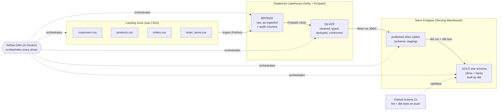

# Capstone Project — E-Commerce Batch Lakehouse Pipeline

> **Your mission:** Build one end-to-end batch data pipeline that takes raw, messy
> e-commerce files and turns them into a clean, tested, query-ready **star schema**
> in a warehouse — orchestrated automatically and backed by CI.
>
> This single project exercises **every** skill on your list. It is deliberately
> *not* flashy or cutting-edge; it is the kind of solid, realistic pipeline a
> data engineer with ~2 years of experience is expected to build and reason about.

---

## 0. How to use this guide (read first)

- This is a **guide, not a solution.** I describe *what* each step must achieve and
  *why*, plus the concepts and the right things to look up. I intentionally do **not**
  hand you finished PySpark / dbt / Airflow code — building it yourself is the entire
  point.
- Work **phase by phase, top to bottom.** Each phase has a **✅ checkpoint** — do not
  move on until it passes.
- When you get stuck, bring me the **specific** step, your attempt, and any error.
  I'll explain and guide, not dump code.
- When you finish the whole thing, tell me and I'll write you a detailed summary for
  your notes (same as the earlier projects).

---

## 1. What you will build (the story)

A fictional company, **"ShopHub"**, dumps four raw CSV extracts (customers, products,
orders, order items) into a landing area. Your job is to build the pipeline that:

1. **Ingests** those raw files into a **lakehouse** (Databricks + Delta).
2. **Cleans & conforms** them through a **Medallion architecture** (Bronze → Silver) using **PySpark**.
3. **Publishes** the curated data into a **serving warehouse** (Neon Postgres).
4. **Models** it into a **Gold star schema** with **dbt**, complete with **data quality tests** and **documentation**.
5. Is **orchestrated end-to-end** as a single scheduled **Airflow** DAG running in **Docker**.
6. Is protected by **Git + GitHub Actions CI** that runs your tests automatically.

---

## 2. Skill → component mapping

Every skill you listed has a concrete home in this project:

| Skill | Where it shows up |
|---|---|
| **Python** | Ingestion script, Airflow DAG, glue code |
| **SQL** | dbt models, analytical queries, sanity checks |
| **PySpark** | Bronze → Silver cleaning & transformations in Databricks |
| **Databricks** | The lakehouse compute + Delta tables (Bronze/Silver) |
| **Apache Airflow** | Orchestrates the full DAG with dependencies & retries |
| **dbt** | Silver → Gold star schema, tests, docs, lineage |
| **Docker** | Runs Airflow locally (and optionally dbt) |
| **Git + GitHub Actions** | Version control + CI (lint + dbt tests on push) |
| **Data Modeling** | Designing the Gold star schema (facts + dimensions) |
| **Data Warehousing** | The Gold layer in Neon Postgres (serving warehouse) |
| **Data Lake & Lakehouse** | Delta-based Medallion architecture on Databricks |
| **Data Quality & Governance** | dbt tests, naming conventions, docs, lineage, audit columns |
| **ETL/ELT Pipeline** | The whole flow (ELT: load raw first, transform in-place) |

> Note: **Kafka / real-time** is intentionally **out of scope** — your stack is
> batch-focused, and forcing streaming in would make this a Frankenstein. We'll do a
> dedicated streaming project later.

---

## 3. Architecture overview

### Mermaid diagram



### ASCII fallback (same flow)

```
 RAW CSVs            DATABRICKS LAKEHOUSE              NEON POSTGRES (warehouse)
 ┌────────┐   ingest  ┌────────┐  pyspark  ┌────────┐  jdbc   ┌──────────┐  dbt   ┌──────────┐
 │ 4 .csv │ ────────► │ BRONZE │ ────────► │ SILVER │ ──────► │ staging  │ ─────► │  GOLD     │
 │ files  │  (python) │ (Delta)│  (clean)  │ (Delta)│ (write) │ (raw-ish)│  run   │ star schema│
 └────────┘           └────────┘           └────────┘         └──────────┘  test  └──────────┘
        ▲                  ▲                    ▲                   ▲                  ▲
        └──────────────────┴──── ORCHESTRATED BY AIRFLOW (Docker) ──┴──────────────────┘
                                          │
                                GitHub Actions CI validates dbt models/tests on push
```

### Why this design (the reasoning to internalize)

- **Lakehouse for heavy lifting, warehouse for serving.** Databricks/Delta handles
  raw landing and Spark cleaning (scales, schema-flexible). The curated result is
  published to Postgres, which is the cheap, fast **serving** layer that BI tools and
  analysts query. This split is extremely common in industry.
- **ELT, not ETL.** You land raw data *first* (Bronze), then transform inside the
  platform (Silver via Spark, Gold via dbt). Raw is always preserved and replayable.
- **Medallion** gives you clear data-quality "zones": Bronze = trust nothing,
  Silver = clean & conformed, Gold = business-ready.
- **Each tool has exactly one job** — no overlap, which keeps the pipeline explainable
  in an interview.

---

## 4. The data (provided for you)

I generated a small, **intentionally messy** dataset in `capstone_data/`:

| File | Rows | Grain |
|---|---|---|
| `customers.csv` | ~52 | one row per customer |
| `products.csv` | 15 | one row per product |
| `orders.csv` | ~122 | one row per order |
| `order_items.csv` | ~311 | one row per line item within an order |

**Relationships:** `order_items.order_id → orders.order_id`,
`order_items.product_id → products.product_id`,
`orders.customer_id → customers.customer_id`.

**Deliberate data-quality problems baked in (your pipeline must handle these):**

- Duplicate rows in `customers`, `orders`, and a duplicate `order_item_id`.
- Missing values: ~12% of emails blank, some `order_date` blank, blank `category`.
- Inconsistent casing/whitespace: `country` ("India"/"india"/"INDIA"), `city`
  ("delhi", "  Pune  "), `status` ("delivered"/"Delivered"/"SHIPPED"), `category`.
- **Mixed date formats** in `orders.order_date` (`YYYY-MM-DD` *and* `DD-MM-YYYY`).
- Bad numerics: a **negative price** and a **zero price** in products; **zero/negative
  quantities** and **zero unit_price** in order_items.
- **Orphan foreign keys**: some `orders.customer_id` and `order_items.product_id`
  point to records that don't exist (referential-integrity violations).

> `capstone_data/generate_data.py` is included if you ever want to regenerate or scale
> the data — but you don't need to run it; the CSVs are already there.

---

## 5. Prerequisites & accounts

- **Python 3.10+** and a virtual environment.
- **Docker Desktop** (you confirmed you can use it now) — for Airflow.
- **Databricks** account (Free/Community Edition) — for the lakehouse.
- **Neon** Postgres (you already have one) — for the serving warehouse.
- **A GitHub repo** for this project — for version control + Actions CI.
- Tools: **DBeaver** (to inspect Postgres), and the **dbt-postgres** adapter.

> **Heads-up on integration friction (read before Phase 4):** orchestrating Databricks
> from Airflow on a *free* Databricks tier can be limited (API/job-trigger
> restrictions). The guide notes a fallback at that step so you're never blocked.

---

## 6. The build — phase by phase

> Legend: **[YOU]** = your action · **[TOOL]** = what the tool does when you run a command.

### PHASE 0 — Project setup & Git

1. **[YOU]** Create a project folder and a fresh **Git repo**; push it to GitHub.
2. **[YOU]** Lay out a clean structure, e.g.:

```
ecommerce-lakehouse/
  ingestion/            # Python: land raw CSVs into Bronze
  notebooks/            # Databricks PySpark notebooks (Bronze->Silver, publish)
  dbt/                  # dbt project (Silver staging -> Gold star schema)
  airflow/              # docker-compose + dags/
  data/                 # the provided CSVs (copy capstone_data here)
  .github/workflows/    # GitHub Actions CI
  .env / .gitignore     # secrets stay OUT of git
  README.md
```

3. **[YOU]** Add a `.gitignore` immediately (ignore `.env`, secrets, dbt `target/`,
   local Spark output). **Never commit credentials.**

**✅ Checkpoint:** repo exists on GitHub, `.gitignore` in place, CSVs copied into `data/`.

---

### PHASE 1 — Lakehouse: land raw into BRONZE

**Goal:** get the four raw files into Databricks as **Bronze Delta tables**, *unchanged*
except for added audit metadata.

1. **[YOU]** In Databricks, upload the 4 CSVs (to DBFS / a Volume) or use the data
   upload UI. This is your landing zone.
2. **[YOU]** Write a PySpark notebook that reads each raw CSV and writes it to a
   **Bronze Delta table** (e.g., `bronze.customers`, `bronze.orders`, ...).
   - Read everything as **strings / permissive** — Bronze should not be picky. The
     point of Bronze is "capture exactly what arrived."
   - Add **audit columns**: an ingestion timestamp and the source filename. (This is
     basic data governance — provenance.)
3. **[YOU]** Do **not** clean anything yet. Duplicates, bad dates, orphans — let them
   all through. Bronze = raw truth.

**Concepts:** Delta Lake basics (ACID tables on files), Medallion "Bronze" intent,
audit/provenance columns, schema-on-read.
**Look up:** `spark.read.csv options`, `write Delta table Databricks`, `current_timestamp pyspark`.

**✅ Checkpoint:** four Bronze Delta tables exist; row counts match the raw files;
audit columns populated.

---

### PHASE 2 — Lakehouse: BRONZE → SILVER (clean & conform with PySpark)

**Goal:** produce **clean, typed, deduplicated, conformed** Silver Delta tables. This is
where you fix every data-quality problem from Section 4. This is the heart of your
PySpark work.

For each table, decide and apply (write down each decision + reason):

- **Deduplicate** (drop exact duplicate rows; for keyed tables, keep one row per key).
- **Cast types** properly: ids as integers, `price`/`unit_price`/`quantity` as numerics,
  dates as real dates.
- **Parse the mixed date formats** in `orders.order_date` into a single real `date`
  type (handle both `YYYY-MM-DD` and `DD-MM-YYYY`; decide what to do with blanks).
- **Standardize text**: trim whitespace; normalize `country`, `city`, `status`,
  `category` to a consistent casing/canonical value (e.g., all the India variants →
  `India`; statuses → lower-case canonical set).
- **Handle bad numerics**: decide your rule for negative/zero `price`, and
  zero/negative `quantity` — filter out, or flag? Justify it.
- **Handle nulls**: blank emails, blank categories, missing order dates — decide per
  column (drop vs keep vs default) and document why.
- **Derive useful columns** where it helps later (e.g., `line_total = quantity * unit_price`).

Leave **referential integrity** (orphan FKs) to be *detected* later by dbt tests — or
optionally flag them here. Decide and note your choice.

**Concepts:** Medallion "Silver" intent, idempotent overwrites, deterministic
dedup, type casting, data standardization, deriving fields.
**Look up:** `pyspark withColumn cast`, `pyspark to_date multiple formats`, `dropDuplicates`,
`when/otherwise`, `trim/lower/initcap`.

**✅ Checkpoint:** four Silver Delta tables, fully typed and clean; re-running the
notebook produces the same result (idempotent); you can articulate every cleaning
decision.

---

### PHASE 3 — Publish SILVER → Neon Postgres (serving layer)

**Goal:** move the curated Silver tables out of the lakehouse into your **Neon Postgres**
warehouse, into a `staging` schema. dbt will build Gold on top of these.

1. **[YOU]** From a Databricks PySpark notebook, write each Silver table to Neon via
   **JDBC** (Postgres driver, with **SSL** required by Neon).
2. **[YOU]** Land them in a dedicated schema, e.g. `staging.customers`,
   `staging.orders`, etc. — keep them separate from anything else in Neon.
3. **[YOU]** Choose a write mode that is **idempotent** (overwrite/replace) so re-runs
   don't duplicate.
4. **[YOU]** Verify in **DBeaver** that the `staging` tables arrived with correct types
   and row counts.

**Concepts:** lakehouse → warehouse publishing, JDBC writes from Spark, SSL to cloud
Postgres, schema separation, idempotent loads.
**Look up:** `pyspark write jdbc postgresql`, `postgres jdbc sslmode require`,
`spark jdbc overwrite mode`.

> **Fallback if Databricks→Neon JDBC is blocked on free tier:** export Silver to CSV/
> Parquet from Databricks, then load into Neon with a small Python script (reuse your
> Project 2 loader). Same end state.

**✅ Checkpoint:** `staging.*` tables visible in Neon via DBeaver, clean and typed.

---

### PHASE 4 — Model GOLD star schema with dbt

**Goal:** turn the `staging` tables into a proper **dimensional model** (star schema) —
the warehouse layer analysts actually query — with **tests and documentation**.

**Design the star schema first (data modeling):** Sketch it before coding. A good target:

- **Dimensions**
  - `dim_customers` (customer_id, name, city, country, signup_date, ...)
  - `dim_products` (product_id, product_name, category, price, ...)
  - `dim_date` (date_key, date, year, quarter, month, day_name, ...) — a generated
    calendar dimension.
- **Fact**
  - `fct_order_items` (grain = **one row per order line item**): foreign keys to
    customer / product / date, plus measures `quantity`, `unit_price`, `line_total`,
    and the order status.

> Decide the **grain** of your fact table explicitly and write it down — grain is the
> single most important data-modeling decision.

**dbt build steps:**

1. **[YOU]** Point dbt at Neon (`profiles.yml`, with `sslmode: require`) and get
   `dbt debug` to pass. (You did this in Project 3 — reuse that knowledge.)
2. **[YOU]** Declare the `staging.*` tables as **sources** in dbt.
3. **[YOU]** Build **staging models** (`stg_*`) as light views over the sources (last
   bit of renaming/typing if needed).
4. **[YOU]** Build **dimension** and **fact** models in a `marts/` folder, wired with
   `ref()` so dbt resolves build order automatically. Materialize marts as **tables**.
5. **[YOU]** Generate `dim_date` (a calendar table — there are standard dbt patterns
   for this).

**Data quality & governance (this is a graded part of the project):**

- Add dbt tests in YAML: `unique` + `not_null` on every primary key,
  `relationships` tests to catch the **orphan foreign keys** (this is where those
  planted bad records get caught!), `accepted_values` on `status`.
- Add `description:` docs to models and key columns.
- Run `dbt docs generate` + `dbt docs serve` to view the **lineage graph**.

**Concepts:** star schema (facts/dims), grain, surrogate vs natural keys, ELT
transformation in-warehouse, dbt sources/refs/materializations, dbt generic tests
(esp. `relationships` for referential integrity), documentation & lineage.

**✅ Checkpoint:** `dbt run` builds all dims + fact; `dbt test` runs and **some
relationship/accepted_values tests legitimately fail** at first (because the data is
dirty) — then you decide how to handle those records and get to a green, explainable
state. Write 3–5 analytical SQL queries against Gold (e.g., revenue by month, top
products, sales by country) to prove it's usable.

---

### PHASE 5 — Orchestrate everything with Airflow (in Docker)

**Goal:** one Airflow **DAG** runs the whole pipeline in order, on a schedule, with
retries — no manual steps.

1. **[YOU]** Stand up Airflow locally using the **official `docker-compose`** setup.
2. **[YOU]** Write a DAG whose tasks mirror your phases and run **in dependency order**:

```
ingest_raw_to_bronze  ->  bronze_to_silver  ->  publish_silver_to_neon
                                                      -> dbt_run -> dbt_test
```

3. **[YOU]** Implement the tasks:
   - dbt steps are easy: run `dbt run` / `dbt test` via a Bash/operator task.
   - For the Databricks steps, trigger your notebooks/jobs via the **Databricks
     operator / REST API** (needs a Databricks token).
4. **[YOU]** Set **dependencies** (`>>`), a **schedule** (e.g., daily), and sensible
   **retries**. Keep secrets in Airflow **Connections/Variables**, not in code.

**Concepts:** DAGs, tasks/operators, dependencies, scheduling, retries, idempotent
tasks, secrets management, orchestration as the "conductor."
**Look up:** `airflow docker compose quickstart`, `BashOperator dbt`,
`DatabricksSubmitRunOperator`, `airflow connections`.

> **Free-tier fallback:** if triggering Databricks jobs from Airflow is restricted on
> your account, have Airflow orchestrate the **ingestion + publish + dbt** steps, and
> run the Databricks Bronze→Silver notebook as a Databricks **scheduled job** that the
> rest of the DAG depends on (document this seam). The orchestration learning is intact.

**✅ Checkpoint:** triggering the DAG once runs the entire pipeline end-to-end; the
graph view shows all tasks green; re-running is safe (idempotent).

---

### PHASE 6 — CI with Git + GitHub Actions

**Goal:** every push to GitHub automatically validates your project.

1. **[YOU]** Add a workflow in `.github/workflows/` that, on push/PR:
   - sets up Python + installs dbt,
   - runs **`dbt compile`** (or `dbt build --target ci`) and **`dbt test`** against a
     CI target (you can point at a dedicated Neon schema/branch),
   - optionally lints SQL with **sqlfluff** and Python with **ruff/flake8**.
2. **[YOU]** Make a small change on a branch, open a PR, and watch the checks run.

**Concepts:** CI/CD basics, automated testing as a quality gate, secrets in GitHub
Actions, "tests must pass before merge" culture.
**Look up:** `github actions python workflow`, `dbt github actions`, `sqlfluff`.

**✅ Checkpoint:** a green CI run visible on a PR; a deliberately broken model/test
turns the check red.

---

## 7. Definition of done (the whole project)

- [ ] Raw CSVs land in **Bronze** Delta tables (with audit columns).
- [ ] **Silver** tables are clean, typed, deduped, conformed (idempotent).
- [ ] Silver published to **Neon `staging`** schema.
- [ ] **Gold star schema** (dims + fact, defined grain) built by dbt.
- [ ] dbt **tests** (unique, not_null, relationships, accepted_values) present, with the
      planted data issues handled and explained.
- [ ] dbt **docs + lineage** generated.
- [ ] **Airflow DAG** runs the whole thing end-to-end on a schedule, with retries.
- [ ] Runs inside **Docker**; secrets kept out of code.
- [ ] **GitHub Actions CI** runs tests on push; a clean README documents architecture,
      decisions, and how to run it.

---

## 8. Stretch goals (only after the core works)

- **Incremental models** in dbt (process only new orders) instead of full rebuilds.
- **Slowly Changing Dimension (SCD Type 2)** on `dim_customers` (track history).
- **Great Expectations** or dbt-expectations for richer data-quality checks.
- **Basics of Kubernetes**: deploy Airflow on a local `kind`/`minikube` cluster.
- A tiny **dashboard** (Metabase/Streamlit) on top of the Gold schema.

---

## 9. Suggested order of attack (don't try it all at once)

1. Phase 0 (repo) → Phase 1 (Bronze) → Phase 2 (Silver). Get the lakehouse half solid.
2. Phase 3 (publish) → Phase 4 (dbt Gold + tests). Get the warehouse half solid.
3. **Only then** Phase 5 (Airflow) to tie it together, and Phase 6 (CI) to harden it.

Build it **manually first, automate last.** Trying to wire Airflow before the steps work
by hand is the #1 way people get stuck.

---

## 10. Working with me

- Bring me one phase at a time. Tell me where you are and what's confusing.
- Paste errors verbatim — especially around Databricks↔Neon connectivity, JDBC/SSL,
  Airflow-in-Docker, and dbt `relationships` tests; those are the classic snag points.
- When the whole pipeline is green end-to-end, say **"capstone done"** and I'll write
  your full project summary for your notes.

Good luck — start with **Phase 0** and **Phase 1**, and come back when Bronze tables
exist in Databricks (or when you hit the first wall).
